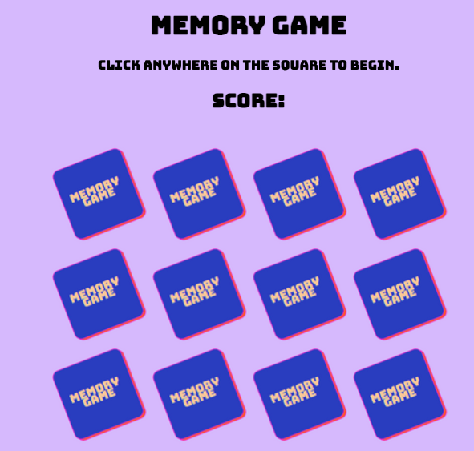

# Memory Game

  )

 

  ## Description
  Memory Game is a quick and simple game where a use can select a card and find its match. If the user finds the correct match, they will earn a point for each correct match.
  

  [Deployed application](https://jessvarghese.github.io/Memory-Game/)

  ## Table of Contents

  * [Visuals](#visuals)
  * [License](#license)
  * [Technologies](#technologies)
  * [Credit](#Credit)
  * [Questions](#questions)
 

  ## Visuals

   

  ## License
  This project operates under the [MIT](https://choosealicense.com/licenses/MIT/) license.

  ## Technologies
 * HTML5
 * Javascript
 * CSS

## Credit
Original code from freeCodeCamp.org project on YouTube https://youtu.be/lhNdUVh3qCc led by Ania Kubow (@kubowania). Modified card images and styling.

## Questions
  If you have any questions about the repo, open an issue:
  * Github: https://github.com/JessVarghese/Memory-Game